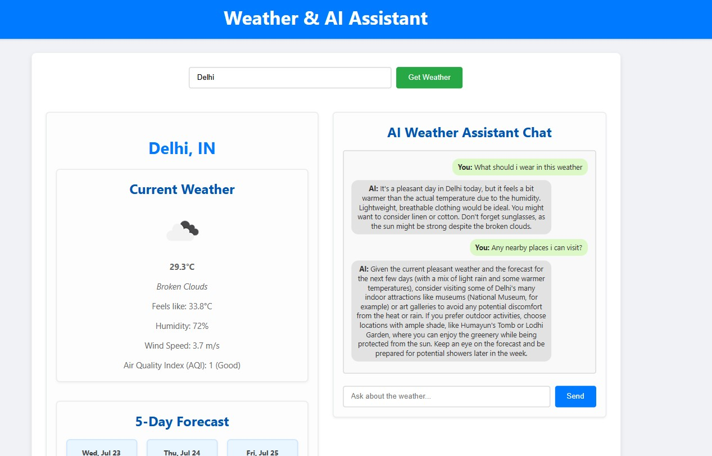
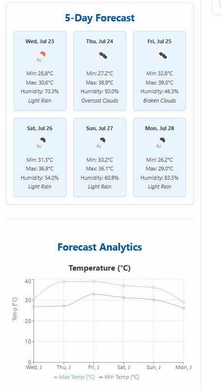

# Weather & AI Assistant


[](https://git.io/typing-svg)

<p align="center" margin-left="1em">
The Weather & AI Assistant is a full-stack web application that combines real-time weather information with an intelligent, contextual AI chat experience. Users can retrieve current weather conditions, a 5-day forecast, and air quality data for any location. Powered by Google Gemini, the integrated AI assistant provides smart, relevant answers to weather-related questions based on the displayed data. This project showcases robust frontend-backend integration using React for the UI and Node.js with Express for handling API requests to OpenWeatherMap and Google Gemini.
</p>
<br>

## 🚀 Preview

Here's a glimpse of the application in action.

<h3 align="center">
  Live Demo (Please ensure both client and server are running locally as per instructions):
  <br>
  Currently, run locally via `http://localhost:3000`
</h3>

<div align="center">
    <br>
    <h4>Key Application Screens:</h4>
    
    <br><br>
    
    <br>
</div>

<hr>

## 💻 Built with

### Frontend
- **React**: A JavaScript library for building user interfaces.
- **Recharts**: A composable charting library built on React components.
- **CSS3**: For styling the web pages.
- **Axios**: Promise based HTTP client for the browser and node.js.

### Backend
- **Node.js**: A JavaScript runtime built on Chrome's V8 JavaScript engine.
- **Express.js**: A fast, unopinionated, minimalist web framework for Node.js.
- **Google Gemini API**: For advanced AI conversational capabilities.
- **OpenWeatherMap API**: Provides current and forecast weather data.
- **CORS**: Middleware to enable Cross-Origin Resource Sharing.
- **Axios**: Promise based HTTP client for making API requests.

### Other Tools / Development Environment
- **Git**: Version control system.
- **npm**: Node Package Manager.
- **VS Code**: Popular integrated development environment.

<div margin="10px" align="center" valign="top">
  
  
  
  
  
  
  
  
  
  
  
  
</div><br>

## ⚙️ Installation Steps

Follow these instructions to set up and run the project locally on your machine.

### Prerequisites

* Node.js (LTS version recommended)
* npm (comes with Node.js) or Yarn

### 1. Clone the Repository

```bash
git clone [https://github.com/your-username/Weather_App_Gemini.git](https://github.com/your-username/Weather_App_Gemini.git)
cd Weather_App_Gemini

Project Structure
Weather_App_Gemini/
├── client/                     # React Frontend
│   ├── public/                 # Public assets
│   ├── src/
│   │   ├── components/         # Reusable React components (WeatherDisplay, Chat)
│   │   │   ├── Chat.js
│   │   │   └── WeatherDisplay.js
│   │   ├── services/           # API interaction functions (weatherService.js)
│   │   │   └── weatherService.js
│   │   ├── App.css
│   │   ├── App.js              # Main React application component
│   │   └── index.js            # React entry point
│   ├── .gitignore              # Git ignore for client-specific files
│   ├── package.json
│   └── README.md (Optional for client)
├── server/                     # Node.js Express Backend
│   ├── routes/                 # API route handlers
│   │   ├── chatRoutes.js       # Handles Gemini API interaction
│   │   └── weatherRoutes.js    # Handles OpenWeatherMap API interaction
│   ├── .env.example            # Example .env file (DO NOT COMMIT YOUR REAL .env)
│   ├── .gitignore              # Git ignore for server-specific files (.env included)
│   ├── index.js                # Main Express application file
│   └── package.json
├── .gitignore                  # Main project .gitignore
├── weather_app.jpg             # Your first screenshot
├── weather_app_1.jpg           # Your second screenshot
└── README.md                   # This file!
